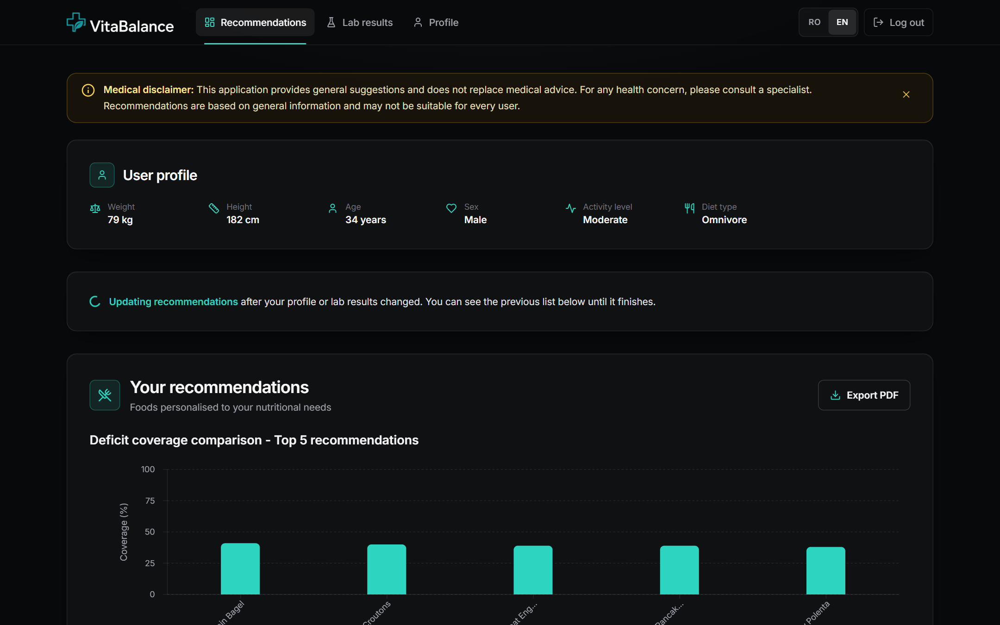
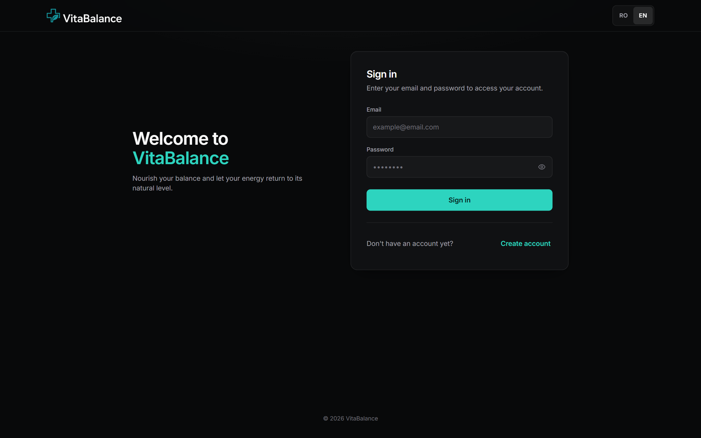
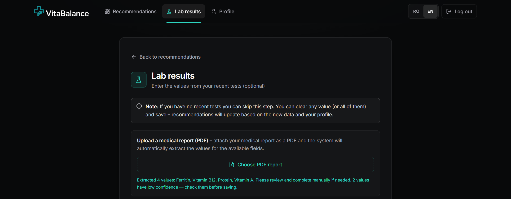
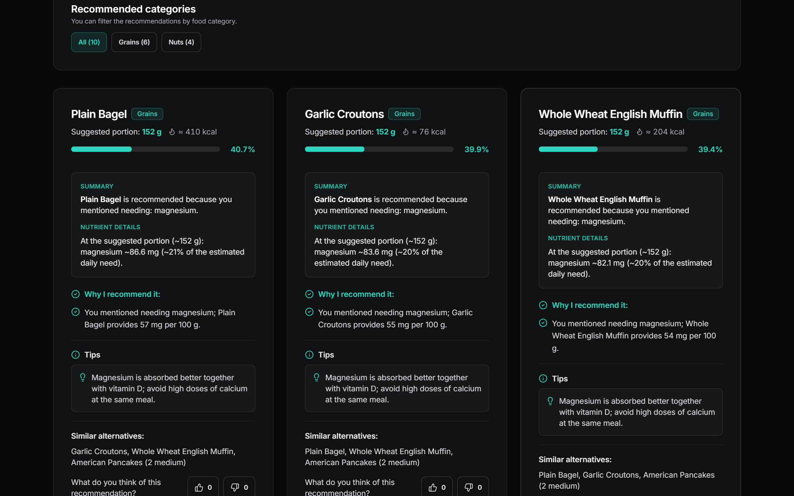
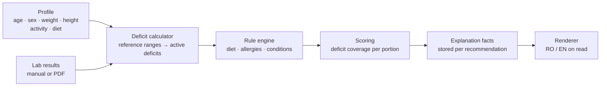
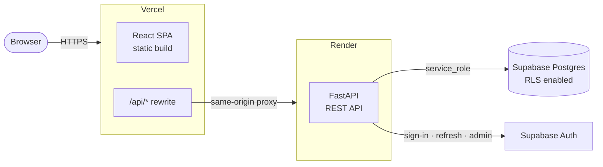

<div align="center">

<picture>
  <source media="(prefers-color-scheme: dark)" srcset="docs/assets/logo-dark.png">
  
</picture>

### Personalised nutrition recommendations from your profile and lab results

Explainable food recommendations that target your actual nutrient deficits while respecting your diet, allergies and medical conditions.

[](https://vita-balance-app.vercel.app)


[Features](#-features) · [How it works](#-how-it-works) · [Architecture](#-architecture) · [Getting started](#-getting-started) · [API](#-api-overview) · [Security](#-security)

<br>



</div>

---

## 📖 About

**VitaBalance** is a full-stack web application that turns a user's profile and blood test results into a short,
ranked list of foods that cover their nutritional gaps. Every recommendation comes with a patient-specific explanation
(*which lab value is low, how much of the daily need one portion covers, why it is safe for this user*), so the result
is something you can understand and verify, not a black box.

It was built as my **Bachelor's thesis (2026)** and is deployed as a public application with real authentication,
a hardened database and a full test suite.

> [!NOTE]
> VitaBalance offers general nutritional guidance and is **not** a substitute for medical advice.

## ✨ Features

| | |
|---|---|
| 🧪 **Lab-driven deficits** | 14 biomarkers (haemoglobin, ferritin, vitamin D, B12, folate, calcium, magnesium, zinc, potassium, iodine, vitamins A, C, K, protein) compared against sex- and age-specific reference ranges. |
| 📄 **PDF report import** | Upload a lab report as PDF; values are extracted in the browser with pdf.js and parsed on the server, with low-confidence values flagged for review. |
| 🥗 **Safe by construction** | A rule engine removes foods that conflict with the user's diet (omnivore, vegetarian, vegan, pescatarian), allergies (including hidden allergens) and 13 medical conditions before anything is scored. |
| 🎯 **Ranked recommendations** | Foods from a 591-item catalogue are scored by deficit coverage, with realistic portion sizes per food category and approximate calories. |
| 💬 **Explainable results** | Each card shows *why* the food was picked, nutrient details for the suggested portion, tips and similar alternatives. Explanations are stored as facts and rendered in **Romanian or English** on demand. |
| 👍 **Feedback loop** | Like or dislike a recommendation; a dislike can instantly swap the food for a suitable alternative, and the vote persists across regenerations. |
| 📊 **Charts & PDF export** | Deficit-coverage chart for the top recommendations, optional daily calorie goal tracker, and a one-click PDF report. |
| 🌍 **Bilingual UI** | Full Romanian / English interface, switchable at any time. |
| 🔐 **Accounts** | Email + password authentication with Supabase Auth, automatic session refresh, per-user data isolation. |

## 🖼️ Screenshots

<table>
  <tr>
    <td width="50%"></td>
    <td width="50%"></td>
  </tr>
  <tr>
    <td align="center"><sub><b>Sign in</b> · email + password, RO/EN switch</sub></td>
    <td align="center"><sub><b>Lab results</b> · manual entry or PDF import</sub></td>
  </tr>
  <tr>
    <td colspan="2"></td>
  </tr>
  <tr>
    <td colspan="2" align="center"><sub><b>Recommendations</b> · portion, coverage, explanation, tips, alternatives and feedback</sub></td>
  </tr>
</table>

## 🧠 How it works



1. **Profile & labs.** The user fills in a profile and, optionally, lab values (typed in or imported from a PDF report).
2. **Deficits.** `DeficitCalculator` compares each biomarker against sex- and age-specific ranges and turns low values into
   nutrient deficits with a severity.
3. **Safety filter.** `ScopedRulesEngine` and `NutritionalRuleEngine` drop every food that is incompatible with the diet,
   allergies or clinical rules (e.g. gluten in coeliac disease, salty foods in hypertension, added sugar in diabetes), using
   `data/medical_rules.json`.
4. **Scoring & portions.** Remaining foods are ranked by how much of the user's deficits a realistic portion covers.
5. **Explanations.** For each pick the backend stores *facts* (lab value vs. threshold, nutrient amounts, diet, allergies,
   portion). Text is rendered from those facts at read time, so switching language never requires regenerating anything.

## 🏗️ Architecture



- The **frontend** is a static React build on Vercel. Calls to `/api/*` are proxied by a Vercel rewrite, so the browser
  only talks to its own origin (no CORS, no backend URL in the bundle).
- The **backend** (FastAPI on Render) owns all business logic and is the only component that talks to Supabase.
- **Supabase Auth** stores credentials; `public.users` holds the app profile, linked to `auth.users` and created by a
  database trigger once an account is confirmed.

## 🛠️ Tech stack

| Layer | Technologies |
|---|---|
| **Frontend** | React 18, TypeScript, Vite, Tailwind CSS, Framer Motion, Recharts, react-i18next, pdf.js, @react-pdf/renderer, Axios |
| **Backend** | Python 3.11, FastAPI, Pydantic v2, httpx, supabase-py |
| **Data & auth** | Supabase (PostgreSQL 17, Row Level Security, Supabase Auth) |
| **Infrastructure** | Vercel (frontend, rewrites, security headers, firewall), Render (API) |
| **Quality** | pytest / unittest (144 tests), ESLint, TypeScript strict build |

## 📁 Project structure

```text
VitaBalance/
├── backend/                      FastAPI application
│   ├── main.py                   API routes
│   ├── config.py                 settings (environment variables)
│   ├── data/                     clinical rules (medical_rules.json)
│   ├── domain/                   domain models and API schemas
│   ├── middleware/               session validation, rate limiting
│   ├── repositories/             Supabase client and one repository per table
│   ├── services/
│   │   ├── auth.py               sign-up / sign-in / refresh via Supabase Auth
│   │   ├── nutrition/            deficits, food categories, lab report parsing
│   │   ├── rules/                diet, allergy and medical-condition rules
│   │   ├── recommendations/      scoring, portions, persistence
│   │   └── explanations/         facts, RO/EN templates, rendering
│   ├── migrations/               incremental SQL migrations
│   ├── schema.sql                full target schema
│   └── tests/                    test suite
├── frontend/                     React + TypeScript SPA
│   └── src/
│       ├── features/             auth, medical profile & labs, recommendations, PDF
│       ├── services/             API client and session storage
│       └── shared/               components, hooks, i18n, utilities
├── docs/
│   ├── assets/ · screenshots/    README images
│   ├── diagrams/                 C4 and UML diagrams (PlantUML)
│   └── demo/                     thesis case studies (profiles, reports, screens)
├── main.py · requirements.txt    entry points for hosts that build from the repo root
└── vercel.json                   build, /api rewrite and security headers
```

## 🚀 Getting started

### Prerequisites

- Python **3.11**
- Node.js **20.19+** (required by Vite 7)
- A [Supabase](https://supabase.com) project (URL + `service_role` key)

### 1. Clone

```bash
git clone https://github.com/CalinGraphics/VitaBalance.git
cd VitaBalance
```

### 2. Database

In the Supabase SQL editor, run [`backend/schema.sql`](backend/schema.sql) on a new project, then import your food
catalogue into the `foods` table. (For an existing database, apply the files in
[`backend/migrations/`](backend/migrations) in order instead.)

### 3. Backend

```bash
cd backend
python -m venv .venv
source .venv/bin/activate          # Windows: .venv\Scripts\activate
pip install -r requirements.txt
```

Create `backend/.env`:

```env
SUPABASE_URL=https://<project-ref>.supabase.co
SUPABASE_SERVICE_ROLE_KEY=<service_role key>
DEBUG=true
```

```bash
python run.py                      # http://localhost:8000 · docs at /docs
```

### 4. Frontend

```bash
cd frontend
npm install
npm run dev                        # http://localhost:3000 (proxies /api to :8000)
```

### 5. Tests

```bash
cd backend && python -m pytest     # backend test suite
cd frontend && npm run lint && npm run build
```

### Environment variables (backend)

| Variable | Required | Description |
|---|:---:|---|
| `SUPABASE_URL` | ✅ | Supabase project URL |
| `SUPABASE_SERVICE_ROLE_KEY` | ✅ | `service_role` key, used server-side only (the app refuses to start with an `anon` key) |
| `DEBUG` | | `true` only for local development (detailed errors, debug routes) |
| `CORS_ORIGINS` | | Comma-separated origins; not needed behind the Vercel rewrite |
| `RATE_LIMIT_AUTH_PER_MIN` | | Requests per minute per IP on `/api/auth/*` (default `24`) |
| `RATE_LIMIT_RECOMMENDATIONS_PER_MIN` | | Requests per minute per IP on `/api/recommendations*` (default `45`) |
| `RATE_LIMIT_TRUSTED_PROXY_HOPS` | | Proxies in front of the app (default `2`: Vercel + Render) |

## 🔌 API overview

All routes are under `/api`; everything except sign-up, sign-in and refresh requires a `Bearer` token.
Interactive documentation is available at `/docs` when running locally.

| Method | Route | Purpose |
|---|---|---|
| `POST` | `/auth/register` · `/auth/login` | Create an account / sign in, returns a Supabase session |
| `POST` | `/auth/refresh` · `/auth/logout` | Renew or revoke the session |
| `GET` | `/auth/me` | Current user |
| `POST` · `GET` | `/profile` · `/profile/by-email/{email}` | Save / read the medical profile |
| `POST` · `GET` | `/lab-results` · `/lab-results/{user_id}` | Save / read lab values |
| `POST` | `/lab-results/extract-from-text` | Parse lab values from report text |
| `POST` | `/recommendations?lang=en` | Generate (or replace) recommendations |
| `GET` | `/recommendations/stored/{user_id}?lang=en` | Stored recommendations, rendered in the chosen language |
| `GET` | `/recommendations/{user_id}/{id}/explanation` | Explanation for a single recommendation |
| `POST` | `/feedback` | Like / dislike a food |

## 🔒 Security

- **Authentication** through Supabase Auth; passwords never touch the application database. Public sign-up is disabled,
  so every account is created through the API's validation and rate limiting.
- **Least privilege:** only the backend accesses the database (`service_role`); the `anon` and `authenticated` roles have
  no table grants. Row Level Security is enabled on every table, with owner-only policies kept as defence in depth.
- **Data isolation:** every protected route checks that the requested resource belongs to the signed-in user.
- **Legacy profiles** created before password accounts can only be claimed after an administrator approves it, so
  nobody can take over someone else's health data by registering with their email.
- **Hardening:** rate limiting on authentication and recommendation routes, Vercel Firewall, and security headers
  (Content-Security-Policy, HSTS, `X-Frame-Options`, `X-Content-Type-Options`, `Referrer-Policy`) on both the site and
  the API.

<details>
<summary><b>Administration: recovering a legacy profile</b></summary>

<br>

Profiles created before password accounts have no linked login (`auth_user_id IS NULL`). After verifying the person's
identity, approve the profile in the Supabase SQL editor; the next sign-up with that email takes it over, together with
its lab results and recommendations:

```sql
update public.users
   set legacy_adoption_approved_at = now()
 where email = 'person@example.com' and auth_user_id is null;
```

List the remaining legacy profiles with `select id, email from public.users where auth_user_id is null;`.

</details>

## ☁️ Deployment

| Component | Platform | Notes |
|---|---|---|
| Frontend | Vercel | Builds `frontend/` from the repo root ([`vercel.json`](vercel.json)); production from `main` |
| API | Render | `uvicorn main:app`, health check `/health`, builds from the repo root |
| Database & auth | Supabase | Schema in [`backend/schema.sql`](backend/schema.sql), history in [`backend/migrations/`](backend/migrations) |

Both Vercel and Render deploy automatically on every push to `main`. Day-to-day work happens on a feature branch
(Vercel builds a protected preview for each push) and is merged into `main` to publish.

> [!TIP]
> On Render's free tier the API sleeps after 15 minutes of inactivity, so the first request can take about a minute.

## 📚 Documentation

- [`docs/diagrams/`](docs/diagrams) — C4 context and container diagrams, UML class, component, package,
  use-case and activity diagrams (PlantUML)
- [`docs/demo/`](docs/demo) — 15 case studies used in the thesis: user profiles, lab reports and resulting screens
- [`docs/metrics.tex`](docs/metrics.tex) — performance evaluation

## ⚠️ Disclaimer

VitaBalance provides general, educational nutrition suggestions. It does not diagnose, treat or prevent any disease and
is not a substitute for professional medical advice. Always consult a doctor or registered dietitian before changing
your diet, especially if you have a medical condition.

## 📄 License

Released under the [MIT License](LICENSE).

## 👤 Author

**Miertescu Ștefan Călin**: Bachelor's thesis, 2026

If you find this project useful, consider giving it a ⭐.
